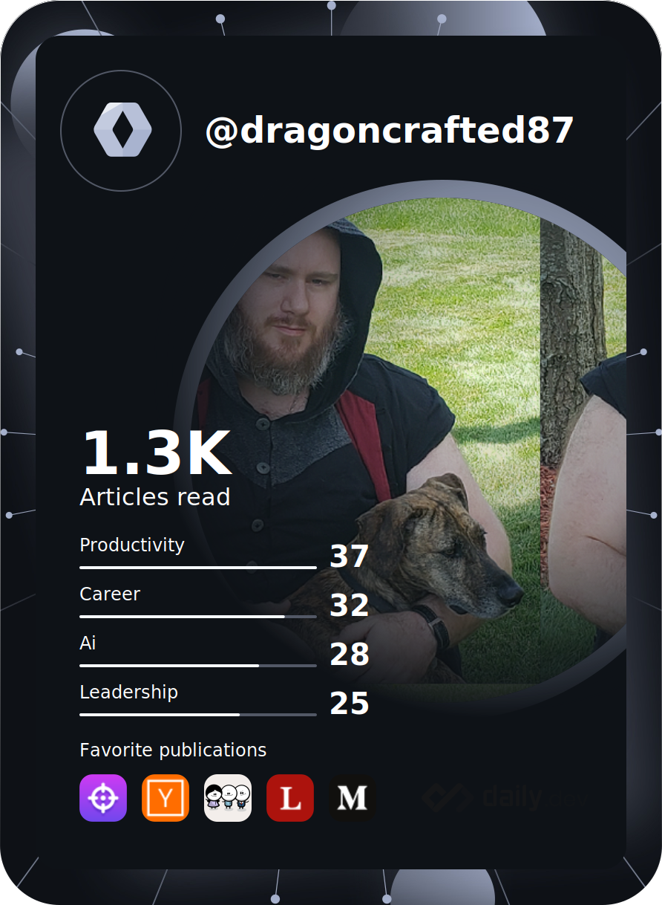

    

    

<table><tr style="border: none;"><td valign="top" width="50%" style="border: none;">
    <h3>Social Dealies:</h3>
    

        
        
        
    

    <h3>Languages:</h3>
    

        
        
        
    

    <h3>Frameworks:</h3>
    

        
    

    <h3>Tools:</h3>
    

        
        
        
        
        
    

</td>
<td valign="top" width="50%" style="border: none;">
    

        
        
        
    

</td></tr></table>
